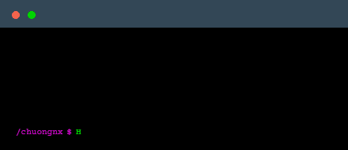

<samp>
<div align="center">
    
    
    
</div>


##  Who am I?



```java
@NoArgsConstructor
@Getter
public class SoftwareEngineer {
    private String name = "Chuongnx";
    private String email = "chuongnx.0611@gmail.com";
    private String phoneNumber = "(+84) 888 062 142";
    private String occupation = "Software Engineer";
    private String[] programingLanguages = {"Java", "Python", "JavaScript"};
    private String[] otherLanguages = {"Pug", "SCSS"};
    private String[] database = {"MySQL", "PostgresSQL", "Oracle"};

    @Override
    public String toString() {
        return String.format("%s | %s | %s", name, phoneNumber, occupation);
    }
}
```

```java
public class Main {
    public static void main(String[] args) {
        SoftwareEngineer chuongnx = new SoftwareEngineer();
        System.out.println(chuongnx);
    }
}
```


##  My favorite tools and technologies

<table>
    <tr>
        <td align="center" width="90" height="90">
            
        </td>
        <td align="center" width="90" height="90">
            
        </td>
        <td align="center" width="90" height="90">
            
        </td>
        <td align="center" width="90" height="90">
            
        </td>
        <td align="center" width="90" height="90">
            
        </td>
    </tr>
    <tr>
        <td align="center" width="90" height="90">
            
        </td>
        <td align="center" width="90" height="90">
            
        </td>
        <td align="center" width="90" height="90">
            
        </td>
        <td align="center" width="90" height="90">
            
        </td>
        <td align="center" width="90" height="90">
            
        </td>
    </tr>
</table>

##  Profile Stats
<details>
    <summary>✒️ GitHub Profile Stats</summary>
        <table align="center">
            <tr>
                <td align="center" colspan="2">
                    
                </td>
            </tr>
            <tr>
                <td align="center">
                    
                </td>
                <td align="center">
                    
                </td>
            </tr>
            <tr>
                <td align="center">
                    
                </td>
                <td align="center">
                    
                </td>
            </tr>
        </table>
</details>

<details>
    <summary>🧩 LeetCode Profile Stats</summary>
        
        
</details>

</samp>